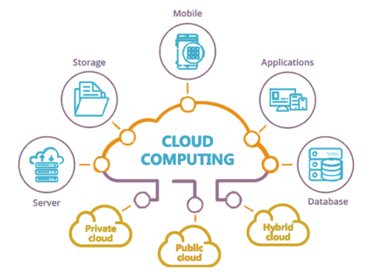
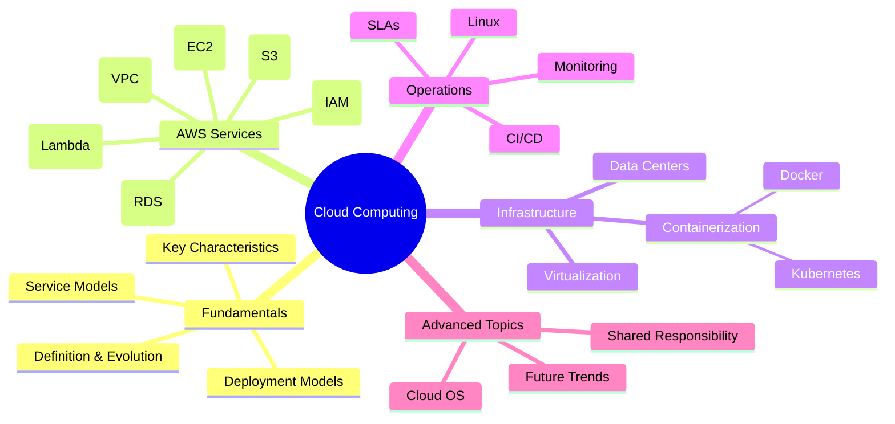

# CSE4267 Cloud Computing Course Notes 📚☁️

<div align="center">

[](https://aws.amazon.com/)
[](https://www.docker.com/)
[](https://kubernetes.io/)
[](https://www.linux.org/)

</div>

## 📋 Overview

This repository contains comprehensive notes and resources for the CSE4267 Cloud Computing course. These materials cover fundamental cloud computing concepts, AWS services, containerization, virtualization, and related technologies to help students understand and master cloud computing principles.

<div align="center">



</div>

## 📑 Table of Contents

- [Course Materials](#course-materials)
- [Key Topics Overview](#key-topics-overview)
- [AWS Services Quick Reference](#aws-services-quick-reference)
- [Practical Guides](#practical-guides)
- [Exam Preparation](#exam-preparation)
- [Shared Responsibility Model](#shared-responsibility-model)
- [Lecture Slides](#lecture-slides)
- [Cheat Sheets](#cheat-sheets)
- [Online Learning Resources](#online-learning-resources)
- [Detailed Course Notes](#detailed-course-notes)

## Course Materials

| Category                     | Description                                       | Files                                                                                                                                                                                          |
| ---------------------------- | ------------------------------------------------- | ---------------------------------------------------------------------------------------------------------------------------------------------------------------------------------------------- |
| **Comprehensive Notes**      | Detailed course notes covering all major topics   | [cloud_computing_note.md](cloud_computing_note.md), [cloud_overview.md](cloud_overview.md)                                                                                                     |
| **PowerPoint Presentations** | Lecture slides for each topic                     | [View All Slides](#lecture-slides)                                                                                                                                                             |
| **PDF Resources**            | Additional reading materials and reference guides | [Cloud Computing for Dummies](Cloud-Computing-for-Dummies-Judith-Hurwitz-Robin-Bloor-Marcia-Kaufman-Fern-Halper-Edisi-1-2010.pdf), [Course Outline](CSE4267%20Cloud%20Computing%20Outline.pdf) |
| **Exam Preparation**         | Materials to help with test preparation           | [Exam Tips](Cloud-Computing-Exam-Tips.pdf), [Practice Questions](AWS-Service-Question-Examples.pdf)                                                                                            |
| **Cheat Sheets**             | Quick reference guides                            | [Docker Cheatsheet](docker_cheatsheet.pdf), [Linux Command Line](Linux%20Command%20Line%20Cheat%20Sheet.pdf)                                                                                   |

## Key Topics Overview

<div align="center">



</div>

## AWS Services Quick Reference

| Service Category | Key Services               | Description                                                                |
| ---------------- | -------------------------- | -------------------------------------------------------------------------- |
| **Compute**      | EC2, Lambda, ECS           | Virtual servers, serverless functions, container orchestration             |
| **Storage**      | S3, EBS, EFS, Glacier      | Object storage, block storage, file storage, archival storage              |
| **Database**     | RDS, DynamoDB, ElastiCache | Relational, NoSQL, and in-memory databases                                 |
| **Networking**   | VPC, Route 53, CloudFront  | Virtual networks, DNS, content delivery network                            |
| **Security**     | IAM, KMS, WAF, Shield      | Identity management, encryption, web application firewall, DDoS protection |
| **Integration**  | SQS, SNS, API Gateway      | Message queues, pub/sub notifications, API management                      |
| **Monitoring**   | CloudWatch, CloudTrail     | Metrics, logs, events, API activity tracking                               |

## Practical Guides

### Docker Quick Start

```bash
# Build an image
docker build -t my-app .

# Run a container
docker run -d -p 8080:80 my-app

# List running containers
docker ps

# Stop a container
docker stop container-id
```

### AWS CLI Essential Commands

```bash
# List S3 buckets
aws s3 ls

# Create an EC2 instance
aws ec2 run-instances --image-id ami-12345678 --instance-type t2.micro

# List running EC2 instances
aws ec2 describe-instances --filters "Name=instance-state-name,Values=running"
```

### Linux Commands for Cloud

```bash
# System information
uname -a         # System information
df -h            # Disk usage
free -m          # Memory usage
top              # Process information

# Network
ping host        # Test connectivity
netstat -tulpn   # Show network connections
ssh user@host    # Connect to remote host
```

## Exam Preparation

### Key Areas to Focus On

- AWS service capabilities and limitations
- Security best practices
- Architectural patterns and anti-patterns
- Cost optimization strategies
- Disaster recovery and high availability

### Practice Resources

- [AWS Certified Cloud Practitioner](https://aws.amazon.com/certification/certified-cloud-practitioner/)
- [AWS Certified Solutions Architect](https://aws.amazon.com/certification/certified-solutions-architect-associate/)
- [Practice Exams](AWS-Service-Question-Examples.pdf)
- [Class Test Examples](Class%20Test%201.pdf)

## Shared Responsibility Model

<div align="center">


</div>

## Lecture Slides

| Topic                                | Presentation                                                                                             |
| ------------------------------------ | -------------------------------------------------------------------------------------------------------- |
| Introduction to Cloud Computing      | [Slides](1.%20Introduction%20to%20Cloud%20Computing.pptx)                                                |
| Resource Sharing in the Cloud        | [Slides](2.%20Resource%20Sharing%20in%20the%20Cloud.pptx)                                                |
| Challenges and Risks                 | [Slides](3.%20Challenges%20and%20Risks%20in%20Cloud%20Computing.pptx)                                    |
| Cloud Service Models                 | [Slides](4.%20Cloud%20Service%20Models.pptx)                                                             |
| IaaS (Amazon EC2)                    | [Slides](<5.%20IaaS%20(Amazon%20EC2).pptx>)                                                              |
| Amazon S3                            | [Slides](6.%20Amazon%20S3.pptx)                                                                          |
| AWS IAM                              | [Slides](<7.%20AWS%20IAM%20(Identity%20and%20Access%20Management).pptx>)                                 |
| AWS VPC                              | [Slides](<8.%20AWS%20VPC%20(Virtual%20Private%20Cloud).pptx>)                                            |
| Introduction to Linux                | [Slides](9.%20Introduction%20to%20Linux.pptx)                                                            |
| AWS Auto Scaling and Load Balancing  | [Slides](10.%20AWS%20Auto%20Scaling%20and%20Load%20Balancing.pptx)                                       |
| Amazon SQS & SNS                     | [Slides](11.%20Amazon%20SQS%20%26%20SNS.pptx)                                                            |
| AWS Route 53                         | [Slides](<12.%20AWS%20Route%2053%20(DNS).pptx>)                                                          |
| AWS SES                              | [Slides](<13.%20AWS%20SES%20(Simple%20Email%20Service).pptx>)                                            |
| Data Centers                         | [Slides](14.%20Data%20Centers.pptx)                                                                      |
| Virtualization                       | [Slides](15.%20Virtualization.pptx)                                                                      |
| Containerization                     | [Slides](16.%20Containerization_%20Application%20Deployment.pptx)                                        |
| Docker                               | [Slides](17.%20Docker_%20Containerization%20Simplified.pptx)                                             |
| Kubernetes                           | [Slides](18.%20Introduction%20to%20Kubernetes.pptx)                                                      |
| API Gateway                          | [Slides](19.%20Understanding%20API%20Gateway.pptx)                                                       |
| Amazon CloudFront                    | [Slides](20.%20Amazon%20CloudFront.pptx)                                                                 |
| Amazon RDS                           | [Slides](21.%20Amazon%20RDS.pptx)                                                                        |
| AWS Security                         | [Slides](22.%20AWS%20Security_%20KMS%2C%20WAF%2C%20and%20Shield.pptx)                                    |
| Capacity Planning & Cloud Brokers    | [Slides](23.%20Capacity%20Planning%20%26%20Cloud%20Brokers.pptx)                                         |
| Service-Level Agreements             | [Slides](<24.%20Service-Level%20Agreements%20(SLAs)%20%20in%20Cloud%20Computing.pptx>)                   |
| CI/CD                                | [Slides](25.%20CI_CD_%20Streamlining%20Software%20Delivery.pptx)                                         |
| Serverless Computing with AWS Lambda | [Slides](26.%20Serverless%20Computing%20with%20AWS%20Lambda.pptx)                                        |
| Monitoring & Logging in AWS          | [Slides](<27.%20Monitoring%20%26%20Logging%20in%20AWS%20(CloudWatch%2C%20CloudTrail%2C%20Logging).pptx>) |
| AWS Budget and Cost Optimisation     | [Slides](28.%20AWS%20Budget%20and%20Cost%20Optimisation.pptx)                                            |
| Cloud Operating Systems and Servers  | [Slides](29.%20Cloud%20Operating%20Systems%20and%20Servers.pptx)                                         |
| Revision Class                       | [Slides](30.%20REVISION%20CLASS.pptx)                                                                    |
| All Topics Combined                  | [Slides](CloudComputingAll.pptx)                                                                         |

## Cheat Sheets

- [Docker Cheatsheet](docker_cheatsheet.pdf)
- [Linux Command Line Cheat Sheet](Linux%20Command%20Line%20Cheat%20Sheet.pdf)

## Online Learning Resources

### Official Documentation

- [AWS Documentation](https://docs.aws.amazon.com/)
- [AWS Architecture Center](https://aws.amazon.com/architecture/)
- [AWS Well-Architected Framework](https://aws.amazon.com/architecture/well-architected/)
- [Docker Documentation](https://docs.docker.com/)
- [Kubernetes Documentation](https://kubernetes.io/docs/)

### Free Learning Platforms

- [AWS Training and Certification](https://aws.amazon.com/training/)
- [AWS Skill Builder](https://explore.skillbuilder.aws/learn)
- [Microsoft Learn for Azure](https://learn.microsoft.com/en-us/training/azure/)
- [Google Cloud Training](https://cloud.google.com/training)
- [Docker Getting Started](https://docs.docker.com/get-started/)
- [Kubernetes Tutorials](https://kubernetes.io/docs/tutorials/)

### YouTube Channels

- [AWS Online Tech Talks](https://www.youtube.com/channel/UCT-nPlVzJI-ccQXlxjSvJmw)
- [TechWorld with Nana](https://www.youtube.com/c/TechWorldwithNana)
- [freeCodeCamp.org](https://www.youtube.com/c/Freecodecamp)
- [Cloud Guru](https://www.youtube.com/c/AcloudGuru)

---

## Detailed Course Notes

## 1. Introduction to Cloud Computing

- **Definition**: The delivery of on-demand computing services (servers, storage, databases, networking, software, analytics, intelligence) over the Internet ("the cloud").
- **Analogy**: Similar to utility services (electricity, water) – on-demand, scalable, pay-as-you-go.
- **Core Idea**: Accessing resources remotely instead of owning and managing physical infrastructure.

## 2. Evolution of Computing

- **Mainframe Era (1950s-1970s)**: Centralized computing, large organizations.
- **Client-Server Model (1980s-1990s)**: Decentralized computing with PCs and local servers.
- **Cloud Era (2000s-Present)**: On-demand, globally available, scalable resources enabled by virtualization, internet speed, and storage advances.

## 3. Key Characteristics of Cloud Computing

1. **On-Demand Self-Service**: Users provision resources automatically without human intervention (e.g., launching an AWS VM).
2. **Broad Network Access**: Services accessible over the network via standard devices (laptops, phones, tablets) (e.g., accessing Google Drive).
3. **Resource Pooling**: Provider pools resources (computing, storage) to serve multiple customers (multi-tenant model) with dynamic allocation (e.g., AWS global data centers).
4. **Rapid Elasticity**: Resources can be scaled up or down quickly, automatically or manually, based on demand (e.g., e-commerce site scaling during sales).
5. **Measured Service**: Resource usage is monitored, controlled, and reported (pay-per-use) (e.g., AWS billing based on compute hours/storage used).

## 4. Cloud Service Models (IaaS, PaaS, SaaS)

- **Definition**: Define how cloud services are delivered based on the level of control and management responsibility.
- **Pizza Analogy**:
  - **On-Premise**: Make pizza at home (buy everything, manage everything).
  - **IaaS (Infrastructure as a Service)**: Take and Bake (provider manages infrastructure like oven; you manage OS, toppings, cooking). _Examples: AWS EC2, Google Compute Engine, Azure VMs._ Provides virtualized compute, storage, networks. High control, complex management.
  - **PaaS (Platform as a Service)**: Pizza Delivered (provider manages infrastructure, OS, runtime; you manage application/code). _Examples: AWS Elastic Beanstalk, Google App Engine, Heroku._ Simplifies development, limited environment control.
  - **SaaS (Software as a Service)**: Dining Out (provider manages everything; you use the software). _Examples: Gmail, Dropbox, Salesforce, Microsoft Office 365._ Easy to use, limited customization.
- **Responsibility Sharing**: Varies by model. Users manage more in IaaS, less in PaaS, and least in SaaS. (See slide 13/463/464 diagrams).

## 5. Cloud Deployment Models

- **Public Cloud**: Services offered over the public internet, available to anyone (e.g., AWS, Azure, GCP). Shared infrastructure.
- **Private Cloud**: Cloud infrastructure operated solely for a single organization. Can be on-premise or hosted by a third party. More control, higher cost.
- **Hybrid Cloud**: Combination of public and private clouds, allowing data and applications to be shared between them. Offers flexibility.
- **Community Cloud**: Infrastructure shared by several organizations with common concerns (e.g., security, compliance).
- **Multi-Cloud**: Using multiple public cloud services from different providers.

## 6. Benefits of Cloud Computing

- Cost Efficiency (Reduced CapEx, pay-as-you-go OpEx)
- Scalability and Elasticity
- High Availability and Reliability (Redundancy)
- Faster Deployment and Innovation
- Enhanced Collaboration
- Flexible Storage & Easy Data Backup/Restore
- Mobility and Remote Work Enablement
- Business Continuity / Disaster Recovery

## 7. Challenges in Cloud Computing

- **Data Security and Privacy**: Protecting sensitive data in shared environments. (Mentioned government project constraint).
- **Vendor Lock-in**: Difficulty migrating between cloud providers due to proprietary services/APIs.
- **Downtime Risks**: Service outages impacting business operations.
- **Compliance and Regulatory Issues**: Meeting industry-specific requirements (e.g., GDPR, HIPAA).
- **Performance and Latency**: Delays due to geographical distance or network limitations.
- **Cost Management**: Unpredictable costs, overspending on unused resources.

## 8. Resource Sharing in the Cloud

- **Definition**: Allocating and managing computing resources dynamically among multiple users for optimal usage.
- **Mechanism**: Often achieved through virtualization and multi-tenancy.
- **Example**: Multiple users running isolated VMs on the same physical server.
- **Key Characteristics**: On-Demand Self-Service, Broad Network Access, Resource Pooling (Multi-tenancy), Pay-as-you-go.
- **Multi-Tenancy**: Allows multiple customers (tenants) to share the same infrastructure while maintaining data isolation. Key benefits include efficient resource utilization and reduced cost per user (e.g., Salesforce CRM).
- **Advantages**: Cost Savings, Scalability, High Availability, Increased Collaboration.
- **Challenges**: Data Security Risks, Performance Issues (resource contention), Compliance Issues, Vendor Lock-in.
- **Case Study**: Netflix on AWS dynamically scales resources during peak times.

## 9. AWS Core Services Deep Dive

### Amazon EC2 (Elastic Compute Cloud)

- **Definition**: A web service providing secure, resizable compute capacity (virtual servers) in the cloud (IaaS).
- **Goal**: Simplify web-scale cloud computing for developers.
- **Architecture**: Built on Regions and Availability Zones (AZs). AZs are isolated data centers within Regions for fault tolerance.
- **Key Features**:
  - **Elasticity**: Scale instances up/down based on workload.
  - **Customizable Configurations**: Wide selection of OS, instance types, storage.
  - **Cost Management**: Multiple pricing models (On-Demand, Reserved, Spot, Savings Plans, Dedicated Hosts).
  - **Networking**: Secure environments via VPC.
  - **Integration**: Works with S3, RDS, Lambda, etc.
- **Instance Types**: General Purpose (t2.micro, M/T families), Compute Optimized (c5.large, C family), Memory Optimized (r5.large, R/X families), Storage Optimized (i3.large, I/D/H families), Accelerated Computing (p3.large, P/G/F/V families). Naming convention: Family-Generation-Capability.Size (e.g., `r5d.xlarge`).
- **Use Cases**: Web Hosting, Big Data Analytics, Machine Learning, Gaming, DevOps.
- **Security**: IAM Integration, Security Groups (instance firewall), Key Pairs (SSH access), VPC (network isolation), Data Encryption (EBS, S3, TLS).
- **Storage Options**: EBS (persistent block storage), Instance Store (temporary block storage), EFS (scalable file storage), S3 Integration (object storage).
- **EC2 Auto Scaling**: Automatically adjusts the number of EC2 instances. Components: Scaling Groups, Scaling Policies.
- **Networking**: Elastic IP Addresses (static IPs), Load Balancers (ALB, NLB), VPC Peering.

### Amazon S3 (Simple Storage Service)

- **Definition**: Scalable object storage service (store and retrieve any amount of data).
- **Core Concepts**:
  - **Bucket**: Container for objects (unique name globally). Supports versioning, encryption, access controls.
  - **Object**: File stored in a bucket, identified by a unique key. Includes data and metadata.
  - **Key**: Unique identifier for an object within a bucket.
- **Key Features**:
  - **Scalability**: Automatically scales storage capacity.
  - **Durability**: Designed for 99.999999999% (11 nines) durability.
  - **Availability**: High uptime and regional redundancy.
  - **Security**: Encryption, fine-grained access control.
  - **Performance**: Low-latency, high-throughput.
- **Storage Classes**: Standard (frequent access), Standard-IA (infrequent access), One Zone-IA (infrequent, single AZ), Glacier (long-term archival), Intelligent-Tiering (automatic tiering).
- **Lifecycle Management**: Automate object transition/deletion based on rules.
- **Use Cases**: Backup & Restore, Data Archiving, Big Data Analytics, Static Website Hosting, Media Storage.
- **Security**: Server-Side Encryption (SSE), Client-Side Encryption, Access Management (IAM Policies, Bucket Policies, S3 Access Points), Compliance (GDPR, HIPAA, PCI DSS).
- **Pricing**: Based on Storage (GB/month), Data Transfer (Outbound), Requests (GET, PUT, etc.), Glacier Retrieval speed.
- **Best Practices**: Enable Versioning, Use Lifecycle Policies, Secure Data (Encryption, IAM), Monitor Usage (CloudWatch).

### AWS IAM (Identity and Access Management)

- **Definition**: Securely manage access to AWS services and resources. Free service (pay for resources used).
- **Key Features**: Manage users/access, Granular permissions, Identity federation.
- **Key Concepts**:
  - **Users**: Individual identities with credentials.
  - **Groups**: Collections of users sharing permissions.
  - **Roles**: Temporary credentials, assumed by users or services (e.g., EC2 accessing S3). Preferred over sharing credentials.
  - **Policies**: JSON documents defining permissions (Actions, Resources, Effect: Allow/Deny). Types: AWS Managed, Customer Managed, Inline.
- **Relationship**: Users belong to Groups; Policies attached to Groups/Users/Roles; Roles assumed by Users/Services.
- **Best Practices**: Enable MFA, Principle of Least Privilege, Rotate access keys, Use Roles instead of shared credentials, Monitor activity with CloudTrail.

### AWS VPC (Virtual Private Cloud)

- **Definition**: Logically isolated section of the AWS Cloud to define a virtual network.
- **Purpose**: Launch resources securely, customize networking.
- **Benefits**: Isolation, Flexibility (IP addressing, subnets, routing), Security (Security Groups, Network ACLs), Scalability.
- **Core Components**:
  - **Subnets**: Public (direct internet access via IGW) and Private (no direct internet access).
  - **Route Tables**: Rules for directing traffic.
  - **Internet Gateway (IGW)**: Allows communication between VPC and internet.
  - **NAT Gateway**: Allows private instances to initiate outbound internet connections.
  - **Elastic IP (EIP)**: Static public IP.
- **Security Features**:
  - **Security Groups**: Stateful firewall at the instance level.
  - **Network ACLs (Access Control Lists)**: Stateless firewall at the subnet level.
- **Connectivity**: IGW, VPN, Direct Connect, Peering Connections (connect multiple VPCs).
- **Advanced Networking**: NAT Gateway, Elastic Load Balancer (ELB), VPC Endpoints (private connection to AWS services).
- **Use Cases**: Web Hosting, Hybrid Cloud, Data Analytics.
- **Best Practices**: Design subnets for use cases, Use least privilege (SGs, NACLs), Monitor traffic (VPC Flow Logs), Use NAT Gateways for secure private outbound access.

### AWS Auto Scaling and Load Balancing

- **Auto Scaling**: Automatically adjusts compute resources to meet demand.
  - **Benefits**: Ensures availability, reduces costs (scales down), improves performance.
  - **Features**: Dynamic Scaling, Predictive Scaling, Scheduled Scaling.
- **Load Balancing (ELB)**: Distributes incoming traffic across multiple resources (e.g., EC2 instances).
  - **Types**: Application Load Balancer (ALB - Layer 7 HTTP/S), Network Load Balancer (NLB - Layer 4 TCP/UDP), Classic Load Balancer (Legacy).
  - **Features**: Health Checks, Sticky Sessions, SSL Termination, Cross-Zone Load Balancing.
- **How They Work Together**: Load Balancer distributes traffic; Auto Scaling adds/removes instances based on demand/health checks, ensuring performance and cost efficiency without downtime.
- **Use Cases**: E-commerce platforms (seasonal spikes), Media Streaming, Web Applications.

### Amazon SQS & SNS

- **Amazon SQS (Simple Queue Service)**: Fully managed message queuing service. Decouples microservices.
  - **Why Use**: Reliable, scalable, cost-effective message delivery; handles large workloads, asynchronous communication.
  - **Features**: Standard (at-least-once, best-effort order) & FIFO (exactly-once, strict order) queues, AWS KMS encryption, message retention (1 min - 14 days).
  - **How it Works**: Producers send messages -> Stored in Queue -> Consumers poll & process -> Consumers delete messages.
  - **Use Cases**: Decoupling microservices, async tasks, buffering burst traffic, background jobs.
- **Amazon SNS (Simple Notification Service)**: Fully managed publish/subscribe (pub/sub) messaging service.
  - **Why Use**: High fan-out (deliver to many subscribers), supports multiple protocols (HTTP, Lambda, SMS, SQS, email).
  - **Features**: Topic-based pub/sub, message filtering.
  - **How it Works**: Publishers send to Topic -> SNS distributes to Subscribers via various protocols.
- **SQS + SNS Together**: SNS fans out messages to multiple SQS queues for parallel, decoupled processing.

### AWS Route 53 (DNS)

- **Definition**: Highly available and scalable Domain Name System (DNS) web service.
- **Functions**: Domain registration, DNS routing, Health checks, Traffic management.
- **Key Features**:
  - **Domain Registration**: Register domains directly.
  - **DNS Management**: Create/manage DNS records.
  - **Health Checks**: Monitor resource health, reroute traffic if needed.
  - **Traffic Flow**: Optimize global traffic using Routing Policies (Simple, Weighted, Latency, Geolocation, Failover, Multi-Value Answer).
  - **Integration**: Works with ELB, CloudFront, S3, ACM (for SSL).
- **Hosted Zones**: Public (internet-accessible domains) and Private (internal AWS resources).
- **Record Types**: A (IPv4), AAAA (IPv6), CNAME (alias), MX (mail exchange), TXT (text info, verification).
- **Use Cases**: E-commerce (geolocation routing), Global Apps (latency routing), Disaster Recovery (failover routing).

### AWS SES (Simple Email Service)

- **Definition**: Cloud-based email sending service for transactional and marketing emails.
- **Features**: High deliverability, Scalable, Reliable, Built-in analytics (open, click, bounce rates), Integration (Lambda, SNS).
- **How it Works**: Verify domain/email -> Create SMTP credentials/Use SDK -> Send email. Uses authentication (SPF, DKIM, DMARC) to improve deliverability and prevent spoofing/phishing.
- **Sending Methods**: SMTP Interface, AWS SDKs (e.g., Boto3 for Python).
- **Pricing**: Pay per 1,000 emails sent ($0.10/1k), data transfer for attachments. Free Tier (62k emails/month from EC2).
- **Best Practices**: Use DKIM/SPF, Monitor bounce/complaint rates, Review metrics, Use IAM for access control.

### Amazon CloudFront (CDN)

- **Definition**: Content Delivery Network (CDN) service. Speeds up delivery of static and dynamic web content (images, videos, APIs).
- **How it Works**: Caches content at globally distributed Edge Locations, closer to users, reducing latency.
- **Key Features**:
  - **Global Edge Locations**: 400+ locations.
  - **Caching**: Stores content closer to users. Define TTL with Cache-Control headers.
  - **Security**: Integrates with AWS Shield (DDoS), WAF (web exploits), SSL/TLS encryption, Signed URLs/Cookies (private content).
  - **Dynamic Content & APIs**: Supports dynamic content delivery and API acceleration.
  - **Lambda@Edge**: Run serverless code at edge locations for customization.
- **Use Cases**: Accelerate static websites (hosted on S3), Video streaming, API delivery, Security (block malicious traffic with WAF).
- **Pricing**: Based on Data Transfer Out (per GB, varies by region), HTTP/S Requests, Lambda@Edge usage. Free Tier (1TB data transfer + 10M requests/month).
- **Best Practices**: Use Cache-Control headers, Enable Compression (gzip, Brotli), Monitor (CloudWatch), Use Origin Shield (reduces origin load).

### Amazon RDS (Relational Database Service)

- **Definition**: Managed relational database service. Simplifies setup, operation, and scaling. Handles admin tasks (patching, backups, scaling).
- **Supported Engines**: MySQL, PostgreSQL, MariaDB, Oracle, SQL Server, Amazon Aurora (AWS-optimized MySQL/PostgreSQL compatible).
- **Key Benefits**: High availability (Multi-AZ), Automated backups & point-in-time recovery, Scalable compute/storage.
- **Key Features**:
  - **Automated Backups**: Daily backups + transaction logs (up to 35 days retention).
  - **Multi-AZ Deployments**: Synchronous replication to a standby instance in another AZ for failover.
  - **Read Replicas**: Asynchronous replication (up to 15 replicas) for read-heavy workloads.
- **Use Cases**: Web Applications (WordPress, e-commerce), Enterprise Applications (ERPs, CRMs), Analytics (reporting using read replicas).
- **Scaling**:
  - **Vertical**: Increase instance size (may require downtime).
  - **Horizontal**: Add Read Replicas.
  - **Storage**: Automatically scales up (no downtime for most engines).
- **Best Practices**: Enable automated backups & test restores, Monitor (CloudWatch), Use Reserved Instances for cost optimization, Delete unused instances.
- **Related**: AWS ElastiCache (managed Redis/Memcached for in-memory caching, reduces database load).

### AWS Security (KMS, WAF, Shield)

- **AWS KMS (Key Management Service)**: Managed service for creating and controlling encryption keys.
  - **How it Works**: Uses Customer Master Keys (CMKs), supports automatic key rotation, uses Envelope Encryption (KMS encrypts data key, data key encrypts data). Integrates with S3, EBS, RDS, Lambda, CloudTrail.
- **AWS WAF (Web Application Firewall)**: Protects web apps from common exploits (SQL Injection, XSS).
  - **How it Works**: Works with CloudFront, ALB, API Gateway. Uses WebACLs (rules) to filter requests (block, allow, monitor). Supports Managed Rules (common threats) and Rate-based rules (brute force/DDoS).
- **AWS Shield**: Managed DDoS protection service.
  - **Types**: Standard (free, automatic protection) and Advanced (paid, 24/7 response, insurance). Integrates with CloudFront, Route 53, ELB, EC2.
- **Best Practices**: Enable Shield/WAF for web apps, Use KMS for sensitive data encryption, Use IAM least privilege, Monitor security events (CloudWatch, CloudTrail), Regularly update WAF rules.

### AWS API Gateway

- **Definition**: Fully managed service to create, publish, maintain, monitor, and secure APIs at scale. Acts as an intermediary between clients and backend services.
- **Core Functions**: Request routing, Authentication/Authorization, Rate limiting, Caching, Monitoring/Analytics.
- **Why Use**: Simplified client interaction (single interface), Enhanced security (centralized auth), Scalability (distributes traffic), Monitoring, Performance Optimization (caching).
- **Architecture**: Client -> API Gateway -> Backend Services (Lambda, EC2, etc.).
- **Key Features**: Authentication/Authorization, Rate Limiting, Load Balancing (implicit), Caching, Traffic Shaping, Monitoring/Analytics.
- **API Gateway vs. Reverse Proxy**: API Gateway is specialized for API management; Reverse Proxy is general-purpose (load balancing, SSL termination).
- **Use Cases**: Microservices communication, Serverless applications, Mobile backends, IoT device traffic, Third-party integrations.
- **Best Practices**: Secure endpoints (auth), Enable logging/monitoring, Optimize caching, Set rate limits, Plan for scalability, Document APIs.
- **Providers**: AWS API Gateway, Kong, Apigee, NGINX, Azure API Management.

### AWS Lambda (Serverless)

- **Serverless Computing Definition**: Build and run applications without managing servers. Cloud provider handles infrastructure, scaling, maintenance. Benefits: Reduced operational cost, automatic scaling, faster time-to-market.
- **Key Characteristics**: No server management, Flexible scaling, Pay-as-you-go, High availability/fault tolerance.
- **AWS Lambda Definition**: Compute service running code in response to events without provisioning/managing servers.
- **How it Works**: Developer deploys function -> Event triggers function (API call, S3 upload) -> Lambda executes in isolated environment -> Scales automatically.
- **Use Cases**: Real-time file processing (image resizing), Data transformation (ETL), Web/Mobile backends, IoT backends, Automated backups.
- **Serverless Architecture**: Integrates with API Gateway (REST APIs), DynamoDB (data storage), S3 (object storage), SNS (notifications), etc.
- **Pricing**: Based on number of requests and duration (GB-seconds). Free Tier (1M requests/month, 400K GB-sec/month).

### AWS CloudWatch & CloudTrail (Monitoring & Logging)

- **Importance**: Essential for understanding application behavior and performance.
- **CloudWatch**: Monitoring service for AWS resources and applications.
  - **Features**: Metrics collection, Logs (store, monitor, access), Dashboards, Alarms (trigger actions, e.g., notify via SNS).
- **CloudTrail**: Records AWS API calls for account activity (governance, compliance, auditing).
  - **Features**: Event history, Trails (send logs to S3), Insights (detect unusual activity).
  - **Event Categories**: Management Events (control plane), Data Events (data plane, e.g., S3 object access), Insight Events.
- **CloudWatch vs. CloudTrail**: CloudWatch monitors _performance_ and _operational health_; CloudTrail monitors _API activity_ and _actions_ taken in the account.
- **Logging Best Practices**: Enable multi-region CloudTrail, Use CloudWatch Alarms for anomalies, Centralize logs (S3) & analyze (Athena), Regularly review logs.

### AWS CloudFormation (IaC)

- **Definition**: Service to model and provision AWS resources using Infrastructure as Code (IaC).
- **How it Works**: Uses templates (YAML/JSON) to define resources. Manages resources as a single unit called a Stack.
- **Key Features**: Template-driven, Supports rollback on failure, Stack creation/update/deletion, Integrates with CI/CD pipelines.
- **Template Components**: Parameters, Resources, Mappings, Outputs, Conditions.

### AWS Cost Management (Budgets, Cost Explorer, Pricing Calculator)

- **Cost Optimization Focus**: Minimize expenses while maintaining performance/security.
- **Key Factors**: Right-Sizing, Choosing Pricing Models, Monitoring/Automation.
- **Pricing Models**: On-Demand, Reserved Instances (1-3 yr commitment, discount), Spot Instances (up to 90% discount, interruptible), Savings Plans (flexible, commitment-based discount).
- **AWS Pricing Calculator**: Tool to estimate service costs for planning/forecasting. Supports major services, customization (region, storage), comparison (On-Demand vs. Reserved). URL: [https://calculator.aws/](https://calculator.aws/)
- **AWS Budgets**: Set custom cost/usage budgets, receive alerts (email/SNS), track actual vs. forecasted spend. Supports filtering by Service, Linked Account, Tags.
- **AWS Cost Explorer**: Visualize and analyze spending, track trends, forecast future costs. Granular filtering.
- **Best Practices**: Enable Budgets/Alerts, Use Reserved/Spot instances, Right-size resources, Use Auto Scaling, Monitor with Cost Explorer.

## 10. Data Centers

- **Definition**: Facility housing computer systems, telecommunications, and storage.
- **Purpose**: Centralized IT resource management, support critical applications, high availability/redundancy.
- **Key Components**: Servers, Storage Systems, Networking Equipment, Cooling Systems, Power Supply Units, Security Systems. All interdependent.
- **Design Principles**: Scalability, Redundancy (minimize single points of failure), Efficiency (power, cooling), Security (physical, virtual), Sustainability (eco-friendly).
- **Architecture**: Layers (Physical, Virtual, Application), Topology (Star, Mesh, Leaf-Spine).
- **Power Efficiency**: Metrics (PUE, DCiE). Techniques (Energy-efficient hardware, liquid cooling, renewables).
- **Tier Levels**: Classification based on uptime/redundancy. Tier I (Basic, no redundancy) to Tier IV (Fault-Tolerant, fully redundant). Higher tiers = higher availability = higher cost.
- **Security**: Physical (CCTV, access control), Cybersecurity (Firewalls, encryption), Disaster Recovery (Backup, replication).
- **Sustainability**: Challenges (high energy use). Solutions (Renewable energy, efficient cooling, green certifications like LEED).

## 11. Virtualization

- **Definition**: Creating a virtual (software-based) version of computing resources (servers, storage, networks, OS).
- **Key Benefits**: Improved resource utilization, Reduced IT costs, Enhanced flexibility/scalability, Improved disaster recovery (backups, snapshots).
- **Types**: Server Virtualization, Desktop Virtualization (VDI), Network Virtualization, Storage Virtualization, Application Virtualization.
- **How it Works**:
  - **Hypervisor (VMM)**: Software/firmware/hardware that creates and runs Virtual Machines (VMs).
  - **Guest OS**: OS running inside the VM.
  - **Host OS**: OS managing the physical hardware (for Type 2).
- **Hypervisor Types**:
  - **Type 1 (Bare Metal)**: Runs directly on hardware (e.g., VMware ESXi, Xen, Hyper-V). More efficient, common in data centers.
  - **Type 2 (Hosted)**: Runs on top of a host OS (e.g., VirtualBox, VMware Workstation/Fusion). Easier for desktops.
- **Challenges**: Initial Costs, Complexity (configuration, maintenance), Performance Overhead, Security Concerns (VM escape, hypervisor attacks).
- **Applications**: Cloud Computing (foundation for IaaS), Development/Testing, Disaster Recovery, Education/Training.
- **Future Trends**: Containerization, Edge Computing, VR/AR.

## 12. Containerization (Docker & Kubernetes)

- **Definition**: Lightweight virtualization method packaging applications and dependencies together into containers. Ensures consistency across environments.
- **Key Features**: Lightweight (vs. VMs), Portable, Consistent, Isolated environments.
- **Virtualization vs. Containerization**:
  - Isolation: VMs (Hardware level), Containers (OS level process isolation).
  - OS: VMs (Separate OS per VM), Containers (Share host OS kernel).
  - Boot Time: VMs (Minutes), Containers (Seconds).
  - Resource Usage: VMs (More), Containers (Less).
  - Size: VMs (Larger), Containers (Smaller).
- **How Containers Work**:
  - **Container Engine**: Manages/runs containers (e.g., Docker Engine).
  - **Container Image**: Lightweight, standalone, executable package (template). Built in layers.
  - **Orchestration Tools**: Manage large-scale deployments (e.g., Kubernetes, Docker Swarm).
- **Benefits**: Portability, Efficiency, Scalability, Isolation, Rapid Deployment.
- **Popular Tools**:
  - **Docker**: Most widely used platform. Easy image creation/management. Client-Daemon architecture. Uses Dockerfiles. Docker Compose for multi-container apps.
  - **Kubernetes (K8s)**: Orchestrates containerized applications. Manages scaling, networking, distribution. Open-source (originally Google, now CNCF). Uses declarative configuration. Key Objects: Pod, Service, Deployment, ConfigMap, Ingress.
  - **Podman**: Docker-compatible but daemonless, focuses on security.
- **Use Cases**: Microservices Architecture, CI/CD Pipelines, Hybrid Cloud Deployments.
- **Challenges**: Security (shared host OS vulnerabilities), Learning Curve (Docker/K8s), Resource Management, Compatibility Issues (legacy systems).
- **Future**: Serverless containers, Edge computing, Alternatives (Podman, CRI-O).

## 13. Linux Introduction

- **Definition**: Open-source, Unix-like operating system kernel created by Linus Torvalds (1991). Powers >90% of internet servers.
- **History**: Inspired by Unix (1969), influenced by GNU Project (1983).
- **Core Features**: Open Source (free, customizable), Multiuser Support, Portability (runs on diverse hardware), Security (user/process isolation), Stability (reliable).
- **Architecture**: Hardware -> Kernel (core) -> System Libraries -> Shell (command-line interface) -> Applications.
- **Distributions (Distros)**: Collection of kernel, software packages, tools.
  - **Popular**: Ubuntu (user-friendly), Fedora (cutting-edge), Debian (stability), Arch Linux (customizable).
  - **Lightweight**: Designed for low RAM/storage (old computers, embedded systems). Examples: Tiny Core Linux (~16MB), Puppy Linux (~300MB), AntiX (~400MB).
- **Basic Commands**:
  - Navigation: `ls`, `cd`, `pwd`
  - File Management: `mkdir`, `rm`, `cp`, `mv`
  - System Monitoring: `top`, `df -h`, `free -m`
- **Applications**: Web Servers (Google, Facebook), Supercomputers (100% of top 500), IoT Devices, Programming Platform, Gaming (SteamOS).
- **Desktop Environments**: GNOME, KDE Plasma, XFCE, LXQt, Mate.
- **Advantages**: Cost (Free), Customizability, Performance, Security (resilient to malware), Community Support.
- **Challenges**: Learning curve for beginners, Software compatibility (some proprietary software), Hardware drivers (rare cases).

## 14. Service-Level Agreements (SLAs)

- **Definition**: Formal, legally binding agreement between a cloud service provider (CSP) and a customer defining measurable metrics (uptime, response time, support) and responsibilities. Ensures accountability.
- **Key Components**: Service Scope, Performance Metrics (e.g., 99.9% uptime), Responsibilities (CSP vs. customer), Penalties (credits/refunds for unmet metrics), Exclusions (e.g., scheduled maintenance, customer error).
- **Types**: Standard (predefined, public clouds), Custom (tailored for enterprise), Multi-tier (different levels for different services).
- **Importance**: Ensures transparency, minimizes downtime risk (uptime guarantees), provides legal recourse, builds trust.
- **Common Metrics**: Uptime (e.g., 99.9% = ~8.76 hrs downtime/year), Response Time (support), Data Availability, Security (compliance certs).
- **Calculating Downtime**: Downtime = (1 - Uptime Percentage) \* Total Time in Period. (Example: 99.9% uptime = 0.1% downtime = 0.001 \* 8760 hours/year = 8.76 hours/year).
- **Challenges**: Complexity (measuring performance), Vagueness ("best effort"), Multi-tenancy impact, Enforcement (claiming penalties).
- **Best Practices**: Negotiate clear metrics, Understand exclusions, Monitor compliance (third-party tools), Review/update SLAs.
- **Examples**: AWS EC2 SLA (e.g., 99.99% for Enterprise Support), Azure credits for downtime, Google Cloud tiered SLAs.

## 15. CI/CD (Continuous Integration/Continuous Deployment)

- **Goal**: Faster, reliable software releases through automation.
- **CI (Continuous Integration)**: Developers merge code to a shared repo frequently (multiple times a day). Automated build and test workflows catch bugs early. Tools: Jenkins, GitLab CI, CircleCI.
- **CD (Continuous Delivery vs. Deployment)**:
  - **Delivery**: Automatically deploys to staging for manual approval before production.
  - **Deployment**: Automatically deploys to production (no human intervention). Example: Netflix deploys 1000+ times/day.
- **Pipeline**: Code commit -> Build -> Test -> Deploy to Staging -> (Manual Approval for Delivery) -> Deploy to Production.
- **Key Components**: Source Code Repo (GitHub), Build Server (Jenkins), Testing Frameworks (Selenium), Deployment Tools (Kubernetes, Docker, AWS CodeDeploy).
- **Benefits**: Faster releases, Fewer bugs in production, Better team collaboration, Scalability.
- **Challenges**: Complexity in setup, Cultural resistance, Security risks in automated pipelines.
- **Popular Tools**: Platforms (GitLab, GitHub Actions), Automation (Jenkins, Travis CI), Deployment (Docker, AWS CodeDeploy).
- **Best Practices**: Automate everything, Test in production-like environments, Monitor pipelines.
- **Future Trends**: AI-driven testing, GitOps (IaC), Serverless CI/CD.

## 16. Cloud Operating Systems

- **Definition**: Manages hardware and software resources in a cloud environment, acting as a platform for cloud applications. Enables scalability, virtualization, multi-tenancy.
- **Role**: Manages VMs (provision, monitor, destroy), Resource Management (CPU, memory, storage allocation), User & Access Management (multi-user/tenant), Scalability/Elasticity (auto-scaling), Automation (deployment, monitoring, fault tolerance).
- **Types**: Open Source (OpenStack, CloudStack), Proprietary (Microsoft Azure platform, Google Cloud OS components), Hybrid.
- **Cloud Servers**: Virtual servers running in a cloud environment, hosted by providers (AWS, Azure, GCP). Highly scalable, globally deployable. Types: Compute (EC2), Database (RDS), Storage (S3), Application (Elastic Beanstalk).
- **Key Features**: Elastic Scaling, API Access (programmatic control), Resource Pooling, Self-service Portals, Monitoring & Alerts.
- **vs. Traditional OS**: Cloud OS manages distributed hardware, supports multi-tenancy, highly automated/elastic, API-based. Traditional OS manages local device, single/few users, limited elasticity, manual deployment.
- **Security**: Data Encryption, IAM, Firewalls/Security Groups, Monitoring/Intrusion Detection, Compliance (GDPR, HIPAA).
- **Future Trends**: AI-driven management, Serverless integration, Hybrid cloud support, Security automation, Compliance templates.
- **Compliance**: Adhering to laws/regulations/standards (e.g., GDPR, HIPAA, SOC) for data protection/privacy/integrity. Cloud OS must provide features to meet these.

## 17. Shared Responsibility Model

- **Concept**: Defines security responsibilities between AWS and the customer.
- **AWS Responsibility (Security OF the Cloud)**: Protecting the infrastructure that runs all AWS services (Hardware, Software, Networking, Facilities). Includes physical security, host OS, virtualization layer.
- **Customer Responsibility (Security IN the Cloud)**: Securing applications and data deployed on AWS. Includes customer data, platform/applications/IAM, OS/network/firewall config (for IaaS), client-side/server-side encryption, network traffic protection. Responsibility varies by service type (more for IaaS, less for SaaS).

## 18. Future Trends & Careers

- **Future Trends**: AI/ML in the Cloud, Edge Computing & IoT, Multi-Cloud & Hybrid Cloud, Quantum Computing, Serverless, Containerization growth.
- **Career Paths**: Cloud Engineer, DevOps Engineer, Solutions Architect, Security Specialist.
- **Certifications**: AWS (Cloud Practitioner, Solutions Architect, etc.), Azure Administrator, Google Cloud Associate Engineer, Kubernetes (CKA, CKAD), DevOps certs.

## 19. Course Recap & Quiz Topics

- **Recap**: Covered Virtualization/Containerization (Docker), Serverless/API Gateways, Storage/Databases (S3, RDS), Networking (VPC), CDN (CloudFront), Security/Compliance, Queues/Pub-Sub (SQS, SNS).
- **Quiz 3 Topics**: AWS Security (KMS, WAF, Shield), Capacity Planning/Cloud Brokers, SLAs, CI/CD, Serverless, IaC (CloudFormation)/Monitoring/Logging.
