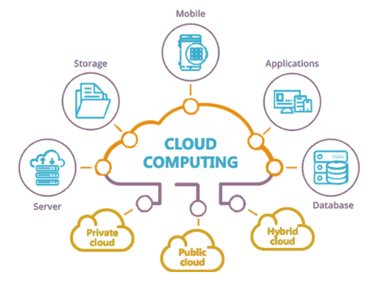
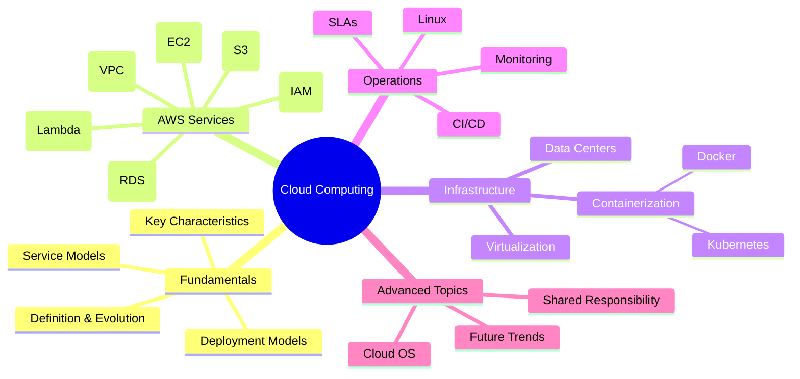

# CSE4267 Cloud Computing Course Notes 📚☁️

[](https://aws.amazon.com/)
[](https://www.docker.com/)
[](https://kubernetes.io/)
[](https://www.linux.org/)

## 📋 Overview

This repository contains comprehensive notes and resources for the CSE4267 Cloud Computing course. These materials cover fundamental cloud computing concepts, AWS services, containerization, virtualization, and related technologies to help students understand and master cloud computing principles.



## 📑 Table of Contents

- [CSE4267 Cloud Computing Course Notes 📚☁️](#cse4267-cloud-computing-course-notes-️)
  - [📋 Overview](#-overview)
  - [📑 Table of Contents](#-table-of-contents)
  - [Course Materials](#course-materials)
  - [Key Topics Overview](#key-topics-overview)
  - [AWS Services Quick Reference](#aws-services-quick-reference)
  - [Practical Guides](#practical-guides)
    - [Docker Quick Start](#docker-quick-start)
    - [AWS CLI Essential Commands](#aws-cli-essential-commands)
    - [Linux Commands for Cloud](#linux-commands-for-cloud)
  - [Exam Preparation](#exam-preparation)
    - [Key Areas to Focus On](#key-areas-to-focus-on)
    - [Practice Resources](#practice-resources)
  - [Shared Responsibility Model](#shared-responsibility-model)
  - [Lecture Slides](#lecture-slides)
  - [Cheat Sheets](#cheat-sheets)
  - [Online Learning Resources](#online-learning-resources)
    - [Official Documentation](#official-documentation)
    - [Free Learning Platforms](#free-learning-platforms)
    - [YouTube Channels](#youtube-channels)
  - [Detailed Course Notes](#detailed-course-notes)

## Course Materials

| Category                     | Description                                       | Files                                                                                                                                                                                                |
| ---------------------------- | ------------------------------------------------- | ---------------------------------------------------------------------------------------------------------------------------------------------------------------------------------------------------- |
| **Comprehensive Notes**      | Detailed course notes covering all major topics   | [cloud_computing_note.md](cloud_computing_notes.md), [cloud_overview.md](cloud_overview.md)                                                                                                          |
| **PowerPoint Presentations** | Lecture slides for each topic                     | [View All Slides](#lecture-slides)                                                                                                                                                                   |
| **PDF Resources**            | Additional reading materials and reference guides | [Cloud Computing for Dummies](PDFs/Cloud-Computing-for-Dummies-Judith-Hurwitz-Robin-Bloor-Marcia-Kaufman-Fern-Halper-Edisi-1-2010.pdf), [Course Outline](<PDFs/CSE4267 Cloud Computing Outline.pdf>) |
| **Exam Preparation**         | Materials to help with test preparation           | [Exam Tips](PDFs/Cloud-Computing-Exam-Tips.pdf), [Practice Questions](PDFs/AWS-Service-Question-Examples.pdf)                                                                                        |
| **Cheat Sheets**             | Quick reference guides                            | [Docker Cheatsheet](PDFs/docker_cheatsheet.pdf), [Linux Command Line](<PDFs/Linux Command Line Cheat Sheet.pdf>)                                                                                     |

## Key Topics Overview



## AWS Services Quick Reference

| Service Category | Key Services               | Description                                                                |
| ---------------- | -------------------------- | -------------------------------------------------------------------------- |
| **Compute**      | EC2, Lambda, ECS           | Virtual servers, serverless functions, container orchestration             |
| **Storage**      | S3, EBS, EFS, Glacier      | Object storage, block storage, file storage, archival storage              |
| **Database**     | RDS, DynamoDB, ElastiCache | Relational, NoSQL, and in-memory databases                                 |
| **Networking**   | VPC, Route 53, CloudFront  | Virtual networks, DNS, content delivery network                            |
| **Security**     | IAM, KMS, WAF, Shield      | Identity management, encryption, web application firewall, DDoS protection |
| **Integration**  | SQS, SNS, API Gateway      | Message queues, pub/sub notifications, API management                      |
| **Monitoring**   | CloudWatch, CloudTrail     | Metrics, logs, events, API activity tracking                               |

## Practical Guides

### Docker Quick Start

```bash
# Build an image
docker build -t my-app .

# Run a container
docker run -d -p 8080:80 my-app

# List running containers
docker ps

# Stop a container
docker stop container-id
```

### AWS CLI Essential Commands

```bash
# List S3 buckets
aws s3 ls

# Create an EC2 instance
aws ec2 run-instances --image-id ami-12345678 --instance-type t2.micro

# List running EC2 instances
aws ec2 describe-instances --filters "Name=instance-state-name,Values=running"
```

### Linux Commands for Cloud

```bash
# System information
uname -a         # System information
df -h            # Disk usage
free -m          # Memory usage
top              # Process information

# Network
ping host        # Test connectivity
netstat -tulpn   # Show network connections
ssh user@host    # Connect to remote host
```

## Exam Preparation

### Key Areas to Focus On

- AWS service capabilities and limitations
- Security best practices
- Architectural patterns and anti-patterns
- Cost optimization strategies
- Disaster recovery and high availability

### Practice Resources

- [AWS Certified Cloud Practitioner](https://aws.amazon.com/certification/certified-cloud-practitioner/)
- [AWS Certified Solutions Architect](https://aws.amazon.com/certification/certified-solutions-architect-associate/)
- [Practice Exams](PDFs/AWS-Service-Question-Examples.pdf)
- [Class Test Examples](<PDFs/Class Test 1.pdf>)

## Shared Responsibility Model


## Lecture Slides

| Topic                                | Presentation                                                                                         |
| ------------------------------------ | ---------------------------------------------------------------------------------------------------- |
| Introduction to Cloud Computing      | [Slides](<Powerpoint Slides/1. Introduction to Cloud Computing.pptx>)                                |
| Resource Sharing in the Cloud        | [Slides](<Powerpoint Slides/2. Resource Sharing in the Cloud.pptx>)                                  |
| Challenges and Risks                 | [Slides](<Powerpoint Slides/3. Challenges and Risks in Cloud Computing.pptx>)                        |
| Cloud Service Models                 | [Slides](<Powerpoint Slides/4. Cloud Service Models.pptx>)                                           |
| IaaS (Amazon EC2)                    | [Slides](<Powerpoint Slides/5. IaaS (Amazon EC2).pptx>)                                              |
| Amazon S3                            | [Slides](<Powerpoint Slides/6. Amazon S3.pptx>)                                                      |
| AWS IAM                              | [Slides](<Powerpoint Slides/7. AWS IAM (Identity and Access Management).pptx>)                       |
| AWS VPC                              | [Slides](<Powerpoint Slides/8. AWS VPC (Virtual Private Cloud).pptx>)                                |
| Introduction to Linux                | [Slides](<Powerpoint Slides/9. Introduction to Linux.pptx>)                                          |
| AWS Auto Scaling and Load Balancing  | [Slides](<Powerpoint Slides/10. AWS Auto Scaling and Load Balancing.pptx>)                           |
| Amazon SQS & SNS                     | [Slides](<Powerpoint Slides/11. Amazon SQS & SNS.pptx>)                                              |
| AWS Route 53                         | [Slides](<Powerpoint Slides/12. AWS Route 53 (DNS).pptx>)                                            |
| AWS SES                              | [Slides](<Powerpoint Slides/13. AWS SES (Simple Email Service).pptx>)                                |
| Data Centers                         | [Slides](<Powerpoint Slides/14. Data Centers.pptx>)                                                  |
| Virtualization                       | [Slides](<Powerpoint Slides/15. Virtualization.pptx>)                                                |
| Containerization                     | [Slides](<Powerpoint Slides/16. Containerization_ Application Deployment.pptx>)                      |
| Docker                               | [Slides](<Powerpoint Slides/17. Docker_ Containerization Simplified.pptx>)                           |
| Kubernetes                           | [Slides](<Powerpoint Slides/18. Introduction to Kubernetes.pptx>)                                    |
| API Gateway                          | [Slides](<Powerpoint Slides/19. Understanding API Gateway.pptx>)                                     |
| Amazon CloudFront                    | [Slides](<Powerpoint Slides/20. Amazon CloudFront.pptx>)                                             |
| Amazon RDS                           | [Slides](<Powerpoint Slides/21. Amazon RDS.pptx>)                                                    |
| AWS Security                         | [Slides](<Powerpoint Slides/22. AWS Security_ KMS, WAF, and Shield.pptx>)                            |
| Capacity Planning & Cloud Brokers    | [Slides](<Powerpoint Slides/23. Capacity Planning & Cloud Brokers.pptx>)                             |
| Service-Level Agreements             | [Slides](<Powerpoint Slides/24. Service-Level Agreements (SLAs)  in Cloud Computing.pptx>)           |
| CI/CD                                | [Slides](<Powerpoint Slides/25. CI_CD_ Streamlining Software Delivery.pptx>)                         |
| Serverless Computing with AWS Lambda | [Slides](<Powerpoint Slides/26. Serverless Computing with AWS Lambda.pptx>)                          |
| Monitoring & Logging in AWS          | [Slides](<Powerpoint Slides/27. Monitoring & Logging in AWS (CloudWatch, CloudTrail, Logging).pptx>) |
| AWS Budget and Cost Optimisation     | [Slides](<Powerpoint Slides/28. AWS Budget and Cost Optimisation.pptx>)                              |
| Cloud Operating Systems and Servers  | [Slides](<Powerpoint Slides/29. Cloud Operating Systems and Servers.pptx>)                           |
| Revision Class                       | [Slides](<Powerpoint Slides/30. REVISION CLASS.pptx>)                                                |
| All Topics Combined                  | [Slides](PDFs/CloudComputingAll.pptx)                                                                |

## Cheat Sheets

- [Docker Cheatsheet](PDFs/docker_cheatsheet.pdf)
- [Linux Command Line Cheat Sheet](<PDFs/Linux Command Line Cheat Sheet.pdf>)

## Online Learning Resources

### Official Documentation

- [AWS Documentation](https://docs.aws.amazon.com/)
- [AWS Architecture Center](https://aws.amazon.com/architecture/)
- [AWS Well-Architected Framework](https://aws.amazon.com/architecture/well-architected/)
- [Docker Documentation](https://docs.docker.com/)
- [Kubernetes Documentation](https://kubernetes.io/docs/)

### Free Learning Platforms

- [AWS Training and Certification](https://aws.amazon.com/training/)
- [AWS Skill Builder](https://explore.skillbuilder.aws/learn)
- [Microsoft Learn for Azure](https://learn.microsoft.com/en-us/training/azure/)
- [Google Cloud Training](https://cloud.google.com/training)
- [Docker Getting Started](https://docs.docker.com/get-started/)
- [Kubernetes Tutorials](https://kubernetes.io/docs/tutorials/)

### YouTube Channels

- [AWS Online Tech Talks](https://www.youtube.com/channel/UCT-nPlVzJI-ccQXlxjSvJmw)
- [TechWorld with Nana](https://www.youtube.com/c/TechWorldwithNana)
- [freeCodeCamp.org](https://www.youtube.com/c/Freecodecamp)
- [Cloud Guru](https://www.youtube.com/c/AcloudGuru)

---

## Detailed Course Notes

For in-depth technical details about AWS services, containerization, serverless computing, and more, refer to the [Cloud Computing Technical Notes](cloud_computing_notes.md).
